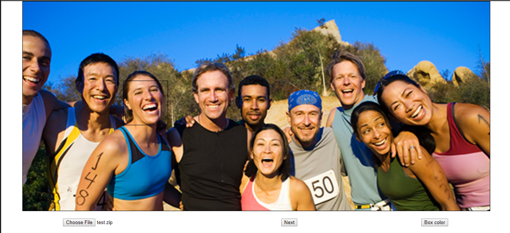

# js_image_cropper
javascript image cropper
---
* Page link : https://unknownpgr.github.io/js_image_cropper/index.html
---
* Open a 'zip file' of images and crop it.
* You can crop the image and download it by click the part you want to crop.
* The cropping area can be resized with the mouse wheel.
* The image is displayed resized to the screen height, but the cropped image is the original size.
* Test image

* image source : google search(https://oralcancerfoundation.org/people/)
